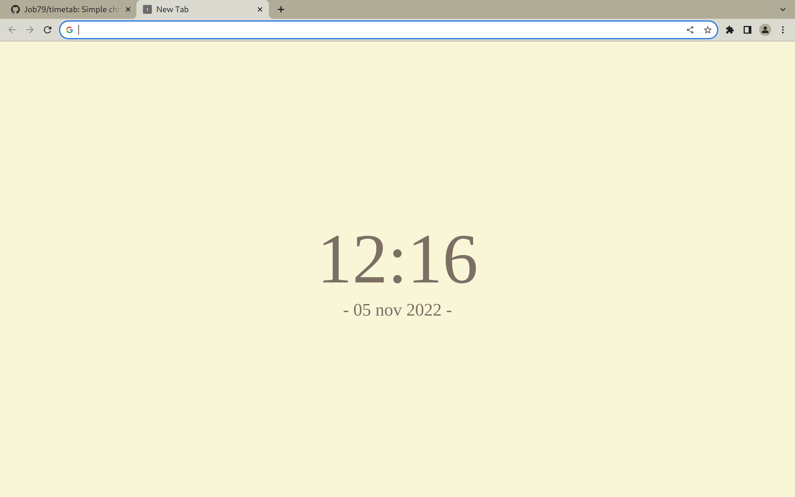

# Timetab
Simple chromium new tab page.

# Installation
- git clone https://github.com/job79/timetab
- open chrome://extensions/ in Chromium
- enable developer mode and click on 'Load unpacked extention'
- select the 'src' folder to import the extenstion
